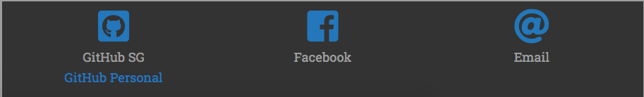

# Online portfolio
## Sparta Global Online Portfolio

This is my online portfolio that I created whilst at Sparta global.

To launch, go to [rcollettsg.github.io](rcollettsg.github.io)

Once there, you can use the navigation bar to jump to any of the following sections.

## Content

### About me

This is the section of the site where I tell you about my experiences with programming. It starts by telling you where I am with my career, then tells you how I got there.

### Tech XP

This section tells you what technologies I am comfortable with using.

### Projects

This section shows you an image of either code or logo used when completing the relevant project and gives you a brief description on what it does and how I made it.

### Contact Me

This section tells you how you can get a hold of me on social media, github and email.

